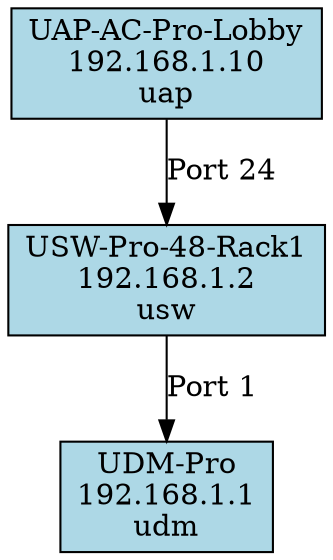

# Topology: unifi2dot

`unifi2dot` is a companion CLI tool that discovers the physical network
topology of a UniFi site by examining device uplink tables and exports
the result as a DOT graph or JSON document.

It is **not** part of the PMDA itself — it runs on-demand, not as a
background daemon.

## Installation

`unifi2dot` is included when you install the `pcp-pmda-unifi` package:

```bash
pip install pcp-pmda-unifi
```

No PCP installation is required to use `unifi2dot`.

## Usage

### Generate a DOT Graph

```bash
unifi2dot \
  --url https://192.168.1.1 \
  --api-key YOUR_API_KEY \
  --site default \
  -o network.dot
```

### Generate a JSON Graph

```bash
unifi2dot \
  --url https://192.168.1.1 \
  --api-key YOUR_API_KEY \
  --site default \
  --format json \
  -o network.json
```

### Render with Graphviz

```bash
# PNG
dot -Tpng network.dot -o network.png

# SVG (better for large networks)
dot -Tsvg network.dot -o network.svg

# PDF
dot -Tpdf network.dot -o network.pdf
```

## Options

| Flag | Description | Default |
|------|-------------|---------|
| `--url` | Controller base URL | required |
| `--api-key` | UniFi API key | required |
| `--site` | Site name slug | `default` |
| `--format` | Output format: `dot` or `json` | `dot` |
| `-o`, `--output` | Output file path | stdout |
| `--is-udm` | Controller is a UDM (prepend /proxy/network) | `true` |
| `--no-verify-ssl` | Skip SSL certificate verification | verify enabled |

## How It Works

1. Queries the UniFi API for all adopted devices on the specified site
2. Examines each device's `uplink` field to determine its upstream connection
3. Builds a directed graph where edges represent physical uplink relationships
4. Nodes are labelled with device name, model, and IP
5. Exports the graph in the requested format

## DOT Output Example



## JSON Output Example

```json
{
  "site": "default",
  "nodes": [
    {"name": "UDM-Pro", "mac": "aa:bb:cc:dd:ee:ff", "model": "udm", "ip": "192.168.1.1"},
    {"name": "USW-Pro-48-Rack1", "mac": "11:22:33:44:55:66", "model": "usw", "ip": "192.168.1.2"},
    {"name": "UAP-AC-Pro-Lobby", "mac": "77:88:99:aa:bb:cc", "model": "uap", "ip": "192.168.1.10"}
  ],
  "edges": [
    {"from": "USW-Pro-48-Rack1", "to": "UDM-Pro", "port": 1},
    {"from": "UAP-AC-Pro-Lobby", "to": "USW-Pro-48-Rack1", "port": 24}
  ]
}
```

## Use Cases

- **Documentation**: Generate up-to-date network diagrams from the controller's
  own data instead of maintaining them manually.
- **Change detection**: Diff the JSON output before and after a maintenance
  window to verify topology is restored.
- **Capacity planning**: Visualise uplink fan-out to identify potential
  bottleneck switches.
